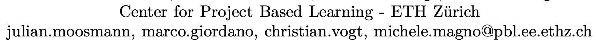

# Inconsistencies from motivating study

Excluding inconsistencies in text spacing and line breaks

# 2306.00001

## xe<>pdf

### font styles

xetex

pdftex

---

# 2306.00002

## xe<>pdf

—

---

# 2306.00004

## xe<>pdf

### font styles

xetex

pdftex

visible difference in the fonts (underscore)

### other styles

size of hyperlink boxes

## xe<>lua

### other styles

---

# 2306.00022

## xe<>pdf

### text styles

difference in quotation marks

pdftex

xetex

## xe<>lua

### image placement

---

# 2306.00036

## xe<>pdf

### missing content

xetex

pdftex

### font styles

xetex

pdftex

### other styles

dimensions of hyperlink boxes

xetex

pdftex

### image placement

this image appears at different places relative to the text (page 1 on pdftex, page 2 on xetex)

## xe<>lua

### references

### image placement

same as xe<>pdf

---

# 2306.00057

(failed to compile)

---

# 2306.00207

## xe<>pdf

### other styles

## xe<>lua

### missing content

xetex

luatex

### other styles

table header and footer:

xetex

luatex

### references

xetex

luatex

---

# 2306.00417

---

# 2306.01308

## xe<>pdf

### image placement

## xe<>lua

### image placement

same as xe<>pdf (above)

---

# 2306.01691

## xe<>pdf

### text styles

