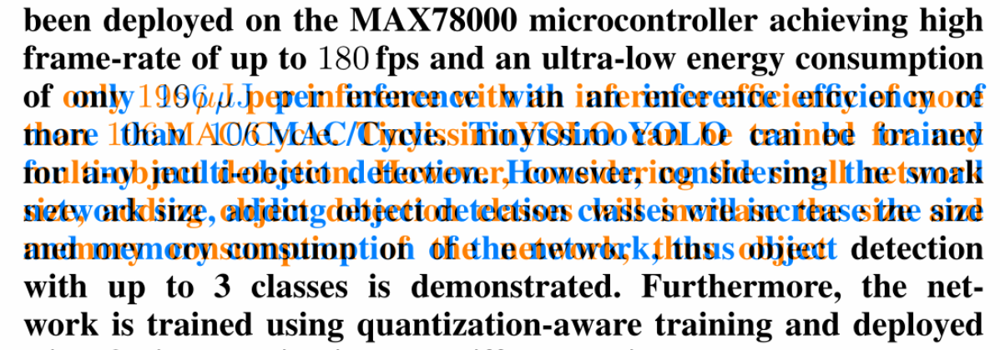
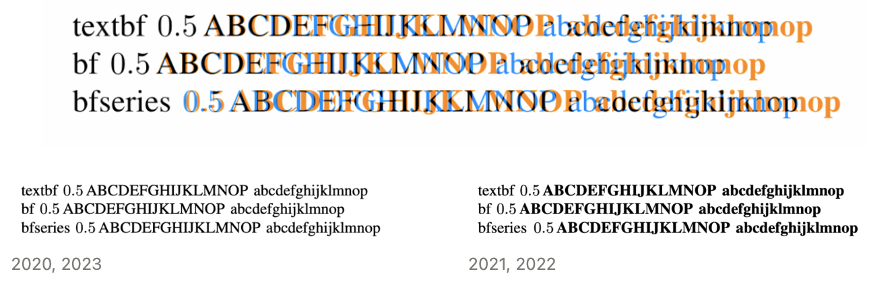

### Overview

**Issue:** Font inconsistencies - SI units are bold in TL2022 but not TL2023

**Triage:** Fixed bug

**Root cause:** `siunitx` did not apply font styles uniformly (see tl2022 vs tl2023)

### Details

Reproduced the issue in `mwe/`:

