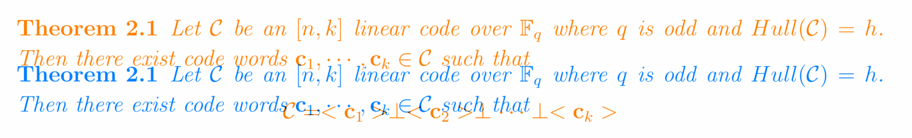

### Overview

**Issue:** Different vertical spacing in TL2022 and TL2023



**Triage:** Fixed bug

**Root cause:** Importing the hyperref package changes vertical spacing

---

### Details

Minimal reproduction (see `mwe/` for the output):

```latex
\documentclass{article}

\usepackage{hyperref}  % commenting this out causes a change in 2022

\newtheorem{theorem}{Theorem}

\begin{document}
% \LinkTargetOff  % use this workaround to prevent the change: https://github.com/lvjr/tabularray/issues/196#issuecomment-1784223410
$$ x=y $$
\begin{theorem}
	theorem after math
\end{theorem}

% \LinkTargetOn
\end{document}
```

Related issues:
- https://github.com/lvjr/tabularray/issues/196
- https://github.com/latex3/hyperref/issues/333
