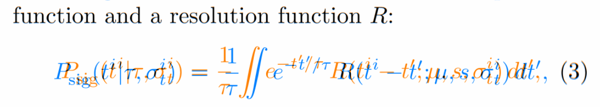

### Overview

**Issue:** Inconsistent spacing around the `eqnarray` environment (TL2021, TL2022)



**Triage:** Fixed bug

**Root cause:** Broken detection of the `eqnarray` environment in the `revtex4-2` package

---

### Details

See `mwe/` in the `2306.01403/` directory for a minimal reproduction with log files.

From the code snippet:

```latex
\documentclass{revtex4-2}

\begin{document}
\begin{eqnarray}
  x=y
\end{eqnarray}
\end{document}
```

TL2020 logs has the following line, which is missing in TL2022:
```
Class revtex4-2 Info: Repairing broken LaTeX eqnarray on input line 406.
```

This comes from the following snippet from the `revtex4-2` class file:

```
\@ifx{\eqnarray\eqnarray@LaTeX}{%
 \class@info{Repairing broken LaTeX eqnarray}%
 \let\eqnarray\eqnarray@fleqn@fixed
 \newlength\eqncolsep
 \setlength\eqncolsep\z@
 \let\eqnarray@LaTeX\relax
 \let\eqnarray@fleqn@fixed\relax
}{}%
```

Fix listed as ["Detection of \eqnarray in newer LaTeX."](https://journals.aps.org/revtex#:~:text=Detection%20of%20%5Ceqnarray%20in%20newer%20LaTeX.)

