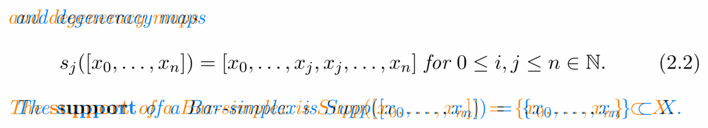
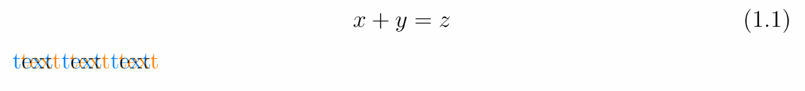

### Overview

**Issue:** Different text spacing observed in TL2022 and TL2023



**Triage:** Fixed bug

**Root cause:** Spaces are ignored after `\\eqno` - see [https://github.com/latex3/latex2e/issues/1059](https://github.com/latex3/latex2e/issues/1059)

---

### Details

A minimal working example is reproduced in `mwe/`.

Code snippet:

```latex
\documentclass[12pt]{article}

\begin{document}
$$x+y=z \eqno{(1.1)}$$
text text text
\end{document}
```

Difference in output when compiled with TL2022 and TL2023:



