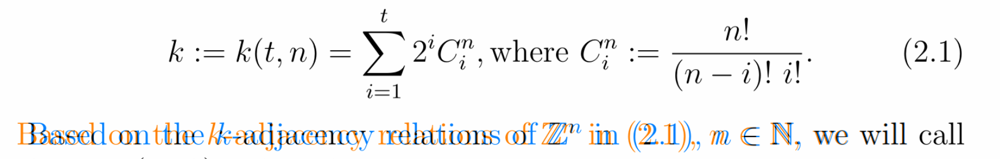

### Overview

**Issue:** Different text spacing observed in TL2022 and TL2023

**Triage:** Fixed bug

**Root cause:** Spaces are ignored after `\\eqno` - see [https://github.com/latex3/latex2e/issues/1059](https://github.com/latex3/latex2e/issues/1059)

---

### Details

Full details and logs of the reproduction can be found in `2306.00746/mwe/`.

